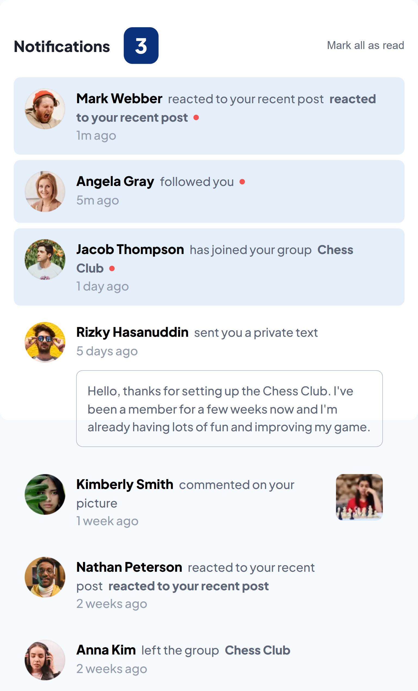

# Frontend Mentor - Notifications page solution

This is a solution to the [Notifications page challenge on Frontend Mentor](https://www.frontendmentor.io/challenges/notifications-page-DqK5QAmKbC).

## Table of contents

- [Overview](#overview)
  - [Screenshot](#screenshot)
  - [Links](#links)
- [My process](#my-process)
  - [Built with](#built-with)
  - [What I learned](#what-i-learned)
  - [Continued development](#continued-development)
- [Author](#author)

## Overview

### Screenshot



### Links

- Solution URL: [solution URL here](https://www.frontendmentor.io/solutions/responsive-react-vite-notifications-section-component-eGgQtW-9zD)
- Live Site URL: [live site URL here](https://notification-list-react-vite.vercel.app/)

## My process

### Built with

- Semantic HTML5 markup
- CSS custom properties
- Flexbox / Grid
- [React](https://reactjs.org/)
- [Vite](https://vitejs.dev/)
- [Plus Jakarta Sans](https://fonts.google.com/specimen/Plus+Jakarta+Sans)

### What I learned

I practiced working with notification logic, managing read/unread states, and implementing dynamic interactions using React state.  
I also implemented smooth UI enhancements like transitions and adaptive layout handling.

```js
// Example of state toggling
setNotifications((prev) =>
  prev.map((n) => (n.id === id ? { ...n, isRead: true } : n))
);
```

### Continued development

# I would like to explore:

- Animating state transitions more smoothly with CSS or Framer Motion

- Adding localStorage to persist read/unread state

- Implementing accessibility improvements for screen readers

### Author

Frontend Mentor – [@frontend-mentor](https://www.frontendmentor.io/profile/PavAndrei)
GitHub – [@GitHub](https://github.com/PavAndrei)
